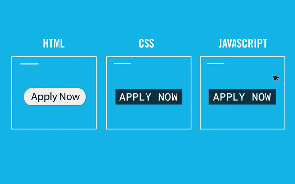
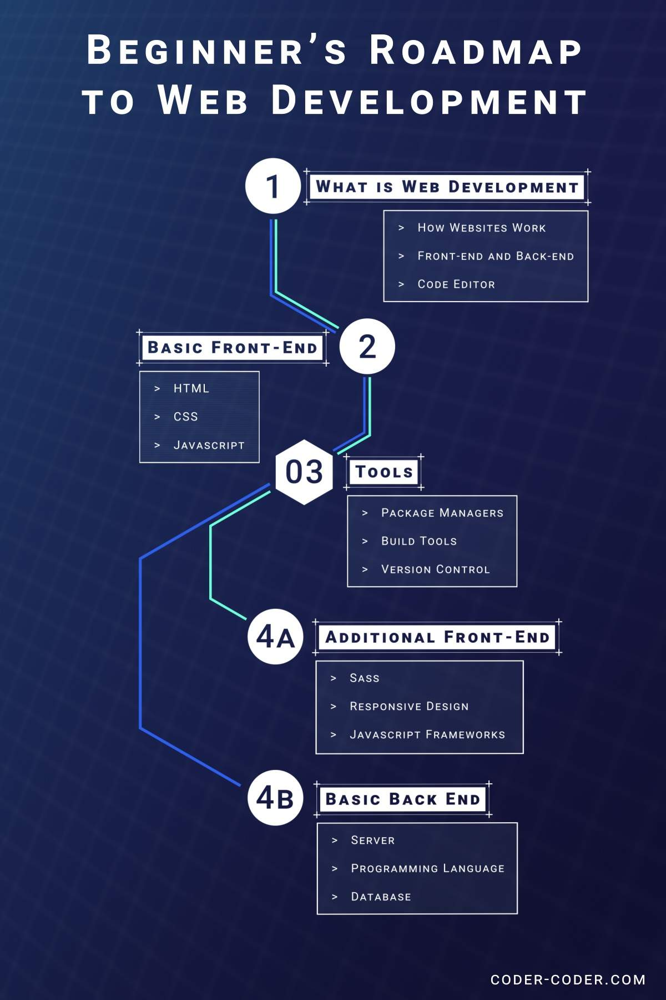

<div align="center">

# `GETTING STARTED WITH WEB-DEVELOPMENT`

<br/>

<a> 
    
</a>
<a>
    
</a>
<a>
    
</a>


<br><br>

### Hi 👋, I'm `Sandeep Shaw`
#### Computer Science & Engineering, 3rd Year 

</div>

- - -

# DISCUSSIONS
- [x] **Types of Basic Websites**: `STATIC`, `DYNAMIC`
- [x] **Developer Types**: `FRONTEND`, `BACKEND`, `FULLSTACK`
- [x] **Development Setup**: `CODE EDITORS`, `DEBUGGER TOOLS`
- [X] **Basics of HTML**: `DOCUMENT STRUCTURE`, `BLOCK` `INLINE`, `TAGS`
- [X] **Important CSS Concept**: `LINK`, `INLINE`, `EMBEDDED` `EXTERNAL`, `SPECIFICITY`, `PSEUDO SELECTOR`, `MEDIA-QUERY`
- [X] **Attributes of Decent Website**: `OPTIMIZATION`, `RESPONSIVE`, `UX`, `UI`
- [x] **Content Delivery Network**
- [x] **Introduction to JavaScript**: `BASIC`, `DOM`, `ES6`, `jQuery`, `NodeJS`
- [X] **Future Roadmap**
- [X] **Useful Resources**

- - -

## 0. WHY HTML / CSS / JS


## 1. STATIC & DYNAMIC WEBSITES


## 2. DEVELOPER STAGES


## 3. SETUP

### > CODE EDITORS
#### `Visual Studio`
#### `Sublime Text`
#### `Atom Editor`
#### `Vim`
#### `NetBeans`
#### `Notepad++`

### > DEBUGGER TOOLS
#### `Chrome Developer Tools`
#### `Firefox Developer Tools.`
#### `Fiddler`(IE)
#### `Safari Developer Tools`
#### `Open Dragonfly`(Opera)

## 4. BASICS OF HTML

> Hyper Text Markup Language
> Extension: `.html`
```html
<!--HTML document declaration-->
<!DOCTYPE html>

<!--HTML Tag: The root-->
<html lang="en">

    <!--Header file, Metadata, Title, etc. -->
    <head>
        <meta charset="UTF-8">
        <meta http-equiv="X-UA-Compatible" content="IE=edge">
        <meta name="viewport" content="width=device-width, initial-scale=1.0">
        <title>Document</title>
    </head>

    <body>
        <!--Visible Content-->
    </body>

</html>
```

#### BLOCK VS INLINE


[](https://www.w3schools.com/html/html_blocks.asp)

## 5. BASICS OF CSS

> Cascading Styling Sheets
> Extension: `.css`

### Ways to use CSS:
- Inline Styling
- Embedded Styling
- External Styling 

#### 1. Inline Styling
```html
    <body style="background-color: rgb(30, 210, 150);">
        <div>
            <h1>Hello Every One</h1>
        </div>
    </body>
```

#### 2. Embedded Styling
```html
    <head>
        <title>Document</title>
        <style>
            body{
                background-color: #59b7b7d4;
                color: beige;
            }
        </style>
    </head>

    <body>
        <div>
            <h1>Hello Every One</h1>
        </div>
    </body>
```

#### 3. External Styling
index.html
```html
<!DOCTYPE html>
<html>
    
    <head>
        <title>Document</title>

        <!--Linking CSS file to html -->
        <link rel="stylesheet" href="style.css">
    </head>

    <body>
        <div>
            <h1>Hello Every One</h1>
        </div>
    </body>

</html>
```
<br/>

style.css
```css
body {
    background-color: #59b7b7d4;
    color: beige;
}
```

### PRIORITY:
> **CSS code: TOP-BOTTOM**
> 1) **Inline CSS**
> 2) **Embedded** OR **External** (Based on position)


### SELECTORS:
- id
- class
- tag

index.html
```html
    <div class="container">
        <h1 id="header-1">Hello Every One</h1>
        <p>
            Lorem ipsum dolor sit amet consectetur 
            adipisicing elit. Voluptas, magnam.
        </p>
    </div>

    <div class="container">
        <h1 id="header-2">Hello Peter !</h1>
        <p>
            Lorem ipsum dolor sit amet consectetur 
            adipisicing elit. Voluptas, magnam.
        </p>
    </div>
```
<br/>

style.css
```css

/* Set stle on Tag Name */
body {
    margin: 0px;
    padding: 0px;
    box-sizing: border-box;
}

p { font-size: 20px; }

/* Set stle on Class Name (.) */
.container{
    display: flex;
    flex-direction: row;
    padding: 10px 20px;
}

/* Set stle on Id Name (#) */
#header-1{
    color: #343434;
}

#header-2{
    color: #546785;
}

```
<br/>

### NESTED STYLING:
```css
/*0,0,1,1*/
.container h1{
    color: green;
}

/*0,1,1,0*/
.container #header-1{
    color: orange;
}

/*0,0,0,2*/
div h1 {
    color: red;
}

/*0,0,0,3*/
body div h1 {
    color: blue;
}
```
<br/>

### ! IMPORTANT:
```css

/*1,0,0,3*/
body div h1 {
    color: blue !important;
}
```
<br/>

### SPECIFICITY:
If there are two or more conflicting CSS rules that point to the same element, the browser follows some rules to determine which one is most specific and therefore wins out.

< **IMPORTANT**, **ID**, **CLASS**, **TAG** >

[](https://www.w3schools.com/css/css_specificity.asp)

<br/>

### PSEUDO SELECTOR:
CSS pseudo-selector are used to add special effects to some selectors on specific events.


[](https://www.w3schools.com/css/css_pseudo_classes.asp)

<BR/>


### MEDIA QUERY:
Using media queries are a popular technique for delivering a tailored style sheet to desktops, laptops, tablets, and mobile phones

[](https://www.w3schools.com/css/css_rwd_mediaqueries.asp)

<br/>

## FEATURES OF WEBSITES


<br/>

## USE OF CDN
A content delivery network (CDN) refers to a geographically distributed group of servers which work together to provide fast delivery of Internet content.

A CDN allows for the quick transfer of assets needed for loading Internet content including HTML pages, javascript files, stylesheets, images, and videos.


> FontAwesome CDN
```html
<!DOCTYPE html>
    <html>
        <head>
            <link rel="stylesheet" href="https://cdnjs.cloudflare.com/ajax/libs/font-awesome/4.7.0/css/font-awesome.min.css">
        </head>
        <body>
            <i class="fa fa-car"></i>
            <i class="fa fa-car" style="font-size:48px;"></i>
            <i class="fa fa-car" style="font-size:60px;color:red;"></i>
            <i class="fa fa-refresh fa-spin"></i>
        </body>
    </html>
```

[](https://www.w3schools.com/icons/fontawesome_icons_brand.asp)

>ChartJS
```html
<!DOCTYPE html>
<html>
    <body>
        <canvas id="myChart" style="width:100%;max-width:700px"></canvas>

        <script src="https://cdnjs.cloudflare.com/ajax/libs/Chart.js/2.9.4/Chart.js"></script>
        <script>
        var xyValues = [
        {x:50, y:7}, {x:60, y:8}, {x:70, y:8}, {x:80, y:9},{x:90, y:9},{x:100, y:9},
        ];

        new Chart("myChart", {
        type: "scatter",
        data: {
            datasets: [{
            pointRadius: 4,
            pointBackgroundColor: "rgb(0,0,255)",
            data: xyValues
            }]
        },
        options: {
            legend: {display: false},
            scales: {
            xAxes: [{ticks: {min: 40, max:160}}],
            yAxes: [{ticks: {min: 6, max:16}}],
            }
        }
        });
        </script>

    </body>
</html>
```


[](https://www.chartjs.org/docs/latest/getting-started/)

<br/>


## BASICS OF JavaScript

### Basics
```html
<!DOCTYPE html>
<html>
    <head>
        <title>Document</title>
    </head>
    <body>
        
        <!--Content-->

        <script>
            //Comment

            //Variable
            let a = 10;
            var b = 20;
            const pi = 3.14;

            //Types
            let x1 = 10;
            let x2 = true;
            let x3 = "Amit";
            let array = [3, 5, 7];
            let mixedArray = [3, true, "Fine"];
            let data = {
                L : "Lateral",
                R : "Registered",
            }
            var nothing = null;
            var empty = undefined;

            //Reserved key words

            //Conditionals
            if(x2){
                alert("Hello First Condition");
            }

            x2 && alert("Hello Second Condition");

            //Using Loops

            //Function
            function displayName(x){
                alert("Hello, "+x)
            }

            x2 && displayName("Sandeep")

            //Prints the value to console
            console.log("Hello, "+x3);
            console.log(`Hello, ${x3}`);
            console.log(array);
            console.log(mixedArray);
            console.log(data);
            console.log(nothing);
            console.log(empty);
            

        </script>
    </body>
</html>
```
<br/>

### Useful Console object
```html
<!DOCTYPE html>
<html >
    <head>
        <title>Document</title>
    </head>
    <body>
        
        <h1>Loaded</h1>
        <!--Content-->

        <script>
            let data = {
                B : "B. Tech",
                M : "M. Tech",
            }

            console.log("Start");
            console.clear();

            console.log(data);
            console.warn(data);
            console.error(data);
            console.table(data);

            console.time()
            complex()
            console.timeEnd()

            function complex(){
                for(let i=0; i<100000; i++){
                    for(let j=0; j<100000; j++){}
                }
            }

        </script>
    </body>
</html>
```

<br/>

### Methods DOM


 Method | 	Description | Example
 --- | --- | --- 
document.getElementById(id) | 	Find an element by element id | document.getElementById("header-1")
document.getElementsByTagName(name) |	Find elements by tag name | document.getElementsByTagName("span")
document.getElementsByClassName(name) |	Find elements by class name | document.getElementsByClassName("container")
document.querySelectorAll() | Query Selector (Combination) | document.querySelectorAll(".conatiner#header")

[](https://www.chartjs.org/docs/latest/getting-started/)

[](https://www.w3schools.com/js/tryit.asp?filename=tryjs_change_style)


<br/>

## FUTURE ROADMAP



<br/>

## RESOURCES

### Web Resources:
| Website |
| ------- |
| https://www.w3schools.com |
| https://freecodecamp.org |  
| https://codecademy.com |  
| https://javascript30.com |  
| https://frontendmentor.io |  
| https://testautomationu.applitools.com |  
| https://coursera.org |  
| https://edx.org |  
| https://khanacademy.org |    

### Photos:

| Website |
| ------- |
| https://unsplash.com |    
| https://pixabay.com |  
| https://pexels.com | 
| https://reshot.com | 
| https://librestock.com |
| https://visualhunt.com | 
| https://freephotos.cc | 
| https://picjumbo.com | 
| https://www.pxfuel.com |
| https://www.splitshire.com |


### Illustrations:

| Website |
| ------- |
| https://www.opendoodles.com |
| https://undraw.co/illustrations |  
| https://drawkit.io |  
| https://icons8.com/ouch |  
| https://iradesign.io |  
| https://interfacer.xyz |  
| https://blush.design |
| https://avataaars.com |

### Icons:

| Website |
| ------- |
| https://fontawesome.com |  
| https://flaticon.com |  
| https://icons8.com |  
| https://iconfinder.com |  
| https://material.io/resources/icons |  
| https://iconmonstr.com | 
| https://heroicons.com |
| https://boxicons.com |

### Fonts:

| Website |
| ------- |
| https://fonts.google.com |  
| https://fontspace.com |  
| https://1001fonts.com |

###  Youtube Channels:

| Website |
| ------- |
| [Programming with Mosh](https://www.youtube.com/user/programmingwithmosh) |
| [CodeWithHarry](https://www.youtube.com/c/CodeWithHarry) |
| [Thapa Technical](https://www.youtube.com/c/ThapaTechnical) |
| [Traversy Media](https://www.youtube.com/c/TraversyMedia) |  
| [freeCodeCamp.org](https://www.youtube.com/c/FreeCodeCamp) |  
| [The Net Ninja](https://youtube.com/c/TheNetNinja) |  
| [Google Chrome Developers](https://www.youtube.com/c/GoogleChromeDevelopers) |  
| [Derek Banas](https://www.youtube.com/c/derekbanas) |  
| [Academind](https://www.youtube.com/c/Academind) |  
| [CodingTech](https://www.youtube.com/c/CodingTech) |  
| [Codú Community](https://www.youtube.com/channel/UCvI5azOD4eDumpshr00EfIw) |  
| [Web Dev Simplified](https://www.youtube.com/c/WebDevSimplified/) |  
| [Dev Ed](https://www.youtube.com/c/DevEd/) |
| [CodeSTACKr](https://youtube.com/c/codeSTACKr) |
| [Coding Addict](https://www.youtube.com/c/CodingAddict) |
| [Kevin Powell](https://youtube.com/kepowob) |
| [Code with Ania Kubów](https://youtube.com/c/AniaKub%C3%B3w) |
| [The Coding Train](https://www.youtube.com/c/TheCodingTrain/) |

[](https://github.com/markodenic/web-development-resources/edit/main/README.md)

- - -

<div align="center">


## Thank You!
### So much

</div>
